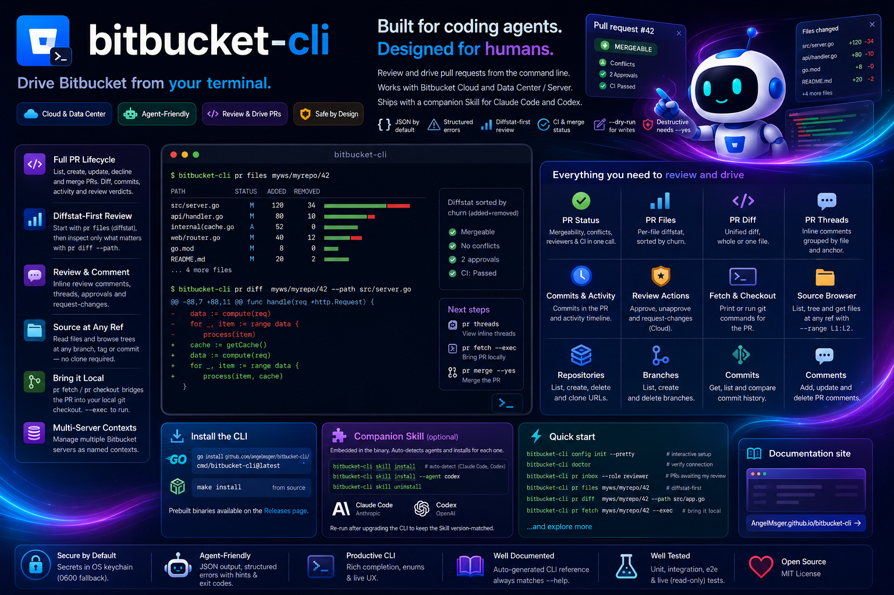

# bitbucket-cli

[](https://github.com/AngelMsger/bitbucket-cli/actions/workflows/ci.yml)
[](https://www.npmjs.com/package/@angelmsger/bitbucket-cli)
[](go.mod)
[](LICENSE)
[](https://angelmsger.github.io/bitbucket-cli/)
[](https://www.atlassian.com/software/bitbucket)

> Drive Bitbucket from your terminal — built for coding agents.

`bitbucket-cli` lets coding agents (Claude Code and others) — and humans — **review and
drive** Bitbucket pull requests from the command line: browse repositories and source
files at any ref, read per-file diffs and diffstats, check mergeability and CI build
status, post inline review comments, and bring a PR into your local git checkout. It
speaks to both **Bitbucket Cloud** and **Data Center / Server**, returns agent-friendly
JSON with structured errors, and ships a companion Skill that teaches an agent how to
use it. Write commands support `--dry-run`, and destructive ones require `--yes`.

📖 **Documentation site:** <https://angelmsger.github.io/bitbucket-cli/>



## Features

- **Cloud & Data Center** — one flavor-agnostic client; the backend (Cloud REST 2.0 or
  Data Center / Server REST 1.0) is detected automatically.
- **Agent-friendly** — JSON output by default, structured errors with exit codes and
  recovery hints, and **diffstat-first** PR review (`pr files` + `pr diff --path`) so an
  agent spends minimal context.
- **Full PR lifecycle** — list, get, create, update, decline and merge pull requests;
  diff (whole or per-file), commits, activity timeline; approve / unapprove /
  request-changes. Every write supports `--dry-run`; destructive commands need `--yes`.
- **PR review closure** — `pr status` aggregates mergeability + conflicts + reviewer
  states + CI build status in one call; `pr threads` groups inline comments by file;
  `pr fetch` / `pr checkout` bridge the PR into your local git checkout (`--exec` to run).
- **Source browsing at any ref** — `file list` / `file tree` / `file get` (with optional
  `--range L1:L2` line slicing) read repository contents at a branch, tag or commit —
  no local clone required.
- **Flexible configuration** — CLI flags, environment variables, a `.env` file, a YAML
  config file, or an interactive wizard; secrets stored in the OS keychain (with a
  `0600` file fallback).
- **Companion Skill** — a `bitbucket` Skill, embedded in the binary, that guides coding
  agents through the CLI.

## Installation

Install the CLI with npm, then take two short steps to finish setup — deploy
the companion Skill, then (optionally) enable shell completion.

### 1. Install the CLI — npm (recommended)

```bash
npm install -g @angelmsger/bitbucket-cli
```

npm downloads the prebuilt binary for your platform, verifies its SHA-256
checksum, and keeps upgrades one `npm update -g @angelmsger/bitbucket-cli`
away.

<details>
<summary><strong>Other install methods</strong> — go install, source build, prebuilt binary</summary>

```bash
go install github.com/angelmsger/bitbucket-cli/cmd/bitbucket-cli@latest   # go 1.24+
make install                                                              # from a source checkout
```

Or download a prebuilt binary from the
[Releases page](https://github.com/AngelMsger/bitbucket-cli/releases). The full
[installation guide](docs/installation.md) covers every method.

</details>

### 2. Deploy the companion Skill

The `bitbucket` Skill is embedded in the binary; it teaches your coding agent
(**Claude Code**, **Codex**) how to drive the CLI. `skill install` probes for
installed agents and installs into each one found:

```bash
bitbucket-cli skill install            # auto-detect; install for each agent found
bitbucket-cli skill install --agent codex
bitbucket-cli skill uninstall          # remove it again
```

Re-run it after upgrading the CLI to keep the Skill version-matched. Details,
including the `npx skills` workflow, are in
[docs/installation.md](docs/installation.md#3-install-the-companion-skill).

### 3. Enable shell completion (optional)

`bitbucket-cli` completes subcommands and enum flag values. Load the completion
script for your shell once:

```bash
source <(bitbucket-cli completion bash)                        # bash, current shell
bitbucket-cli completion zsh > "${fpath[1]}/_bitbucket-cli"    # zsh, persistent
```

fish, PowerShell and persistent setup are covered in
[docs/installation.md](docs/installation.md#2-enable-shell-completion).

## Quick start

```bash
bitbucket-cli config init --pretty   # interactive TUI setup (recommended for humans)
bitbucket-cli doctor                 # verify configuration and connectivity
bitbucket-cli workspace list         # discover the workspaces / projects you can see

# Find what to review (cross-repo "PRs awaiting my review")
bitbucket-cli pr inbox --role reviewer                          # DC: dashboard call; Cloud: add --workspace
bitbucket-cli pr inbox --role author                            # PRs I authored

# Review a PR (diffstat-first → per-file diff → optional local fetch)
bitbucket-cli pr status myws/myrepo/42                          # mergeable? conflicts? CI? reviewers?
bitbucket-cli pr files  myws/myrepo/42                          # per-file diffstat, sorted by churn
bitbucket-cli pr diff   myws/myrepo/42 --path src/server.go     # single-file unified diff
bitbucket-cli pr fetch  myws/myrepo/42 --exec                   # bring the PR into ./refs/remotes/origin/pr/42

# Browse source at any ref — no clone required
bitbucket-cli file get  myws/myrepo --ref main --path src/server.go --range 80:120
bitbucket-cli file tree myws/myrepo --ref v1.2.3 --path src/ --depth 2

# Comment, approve, merge
bitbucket-cli pr threads      myws/myrepo/42
bitbucket-cli comment add --pr myws/myrepo/42 --inline src/server.go:88 \
    --content "Hoist this allocation out of the loop?"
bitbucket-cli pr approve myws/myrepo/42
bitbucket-cli pr merge   myws/myrepo/42 --strategy squash --yes
```

## Configuration

Settings resolve in precedence order (highest first): CLI flags → environment
variables (`BITBUCKET_*`) → `.env` → `~/.angelmsger/bitbucket/config.yaml`
(legacy fallback `~/.bitbucket/config.yaml`) → defaults. See
`.env.example` for the full list. Secrets are stored in the OS keychain (with a
`0600` file fallback) and never written to the config file.

## Commands

| Command | Purpose |
|---------|---------|
| `workspace list` / `workspace get` | discover workspaces (Cloud) / projects (DC) — the values `--workspace` accepts elsewhere |
| `user list` / `user get` / `user me` | discover Bitbucket users — the values `--reviewer` / `--author` accept (Cloud: workspace-scoped via `--workspace`; DC: global) |
| `tag list` / `tag get` | discover repository tags — the values `--ref` accepts (alongside branches and commit hashes) |
| `pr list` / `pr get` | list pull requests; show details (`--scope summary/full/commits/activity`) |
| `pr inbox` | cross-repo "PRs involving me" (`--role reviewer/author/participant`, `--state ...`) — single dashboard call on DC; on Cloud, `--workspace` required for reviewer/participant |
| `pr status` | aggregated merge readiness: mergeable, conflicts, reviewers, CI builds |
| `pr files` | per-file diffstat (`path`/`status`/`added`/`removed`), sorted by churn |
| `pr diff` | unified diff; `--path` scopes to one file |
| `pr threads` | PR comments regrouped into inline threads (by file + anchor) |
| `pr commits` / `pr activity` | commits in the PR; activity timeline |
| `pr create` / `update` / `decline` / `merge` | open / edit / close / merge PRs; `--dry-run`, destructive ones need `--yes` |
| `pr approve` / `unapprove` / `request-changes` | review verdicts (`request-changes` is Cloud only) |
| `pr fetch` / `pr checkout` | print the equivalent `git` commands; `--exec` runs them in your current checkout |
| `file list` / `tree` / `get` | browse and read source at any ref; `--range L1:L2` slices a line range |
| `repo list` / `get` / `clone-url` / `create` / `delete` | manage repositories; `clone-url` prints HTTPS/SSH URLs |
| `branch list` / `get` / `create` / `delete` | manage branches in a repository |
| `commit get` / `list` / `compare` | query commits; walk history; compare two refs |
| `comment list` / `add` / `update` / `delete` | PR comments (`--inline path:line` for review comments) |
| `whoami` | print the user the credentials authenticate as |
| `skill install` / `skill uninstall` | deploy or remove the embedded companion Skill (Claude Code, Codex) |
| `config get-contexts` / `use-context` / `delete-context` | manage multiple named servers |
| `config` / `auth` / `doctor` / `version` | setup and diagnostics |

In the default JSON output, list commands return a `{items, next, has_more}` envelope;
pass `--cursor` with a prior page's `next` to read the following page, or `--all` to
fetch every page. `--format ndjson` instead streams the items themselves, one JSON
object per line.

### Multiple servers (contexts)

A single config file can hold several Bitbucket servers as named *contexts*. Most
users need only one and never see the concept — `config init --pretty` configures a
`default` context and the flow is unchanged. To work with more than one server,
re-run `config init --pretty` and pick **Add a new context**, then:

```bash
bitbucket-cli config get-contexts          # list contexts, current marked
bitbucket-cli config use-context prod      # switch the current context
bitbucket-cli --use-context prod pr list --repo prod-ws/api   # override for one command
```

`BITBUCKET_CONTEXT` overrides the current context via the environment. Legacy
single-server config files are read unchanged.

## Related

Part of a family of agent-facing CLIs — one skeleton, one set of conventions, all
built for coding agents. Browse the full set at
**[github.com/AngelMsger](https://github.com/AngelMsger)**:

- **[confluence-cli](https://github.com/AngelMsger/confluence-cli)** — Confluence as a knowledge base
- **bitbucket-cli** — Bitbucket pull requests & code review *(this project)*
- **[openobserve-cli](https://github.com/AngelMsger/openobserve-cli)** — OpenObserve logs, metrics & traces
- **[jenkins-cli](https://github.com/AngelMsger/jenkins-cli)** — inspect Jenkins jobs & builds

## Use as a Go library

The HTTP client that powers the CLI is published as a standalone Go package, so a
GUI or other tool can drive Bitbucket directly — same normalized models, Cloud /
Data Center flavor handling and structured errors, without shelling out to the
binary.

```go
import (
	"context"
	"net/http"
	"os"

	api "github.com/angelmsger/bitbucket-cli/pkg/apiclient"
	cerr "github.com/angelmsger/bitbucket-cli/pkg/errors"
	"github.com/angelmsger/bitbucket-cli/pkg/transport"
)

// Authentication is a transport.Decorator you supply — it sets the
// Authorization header on every request. PAT uses a Bearer token:
func bearer(token string) transport.Decorator {
	return func(r *http.Request) { r.Header.Set("Authorization", "Bearer "+token) }
}

ctx := context.Background()
client, flavor, err := api.Build(ctx, api.BuildParams{
	BaseURL:       "https://bitbucket.example.com",
	Flavor:        "auto", // "cloud" | "datacenter" | "auto"
	AuthDecorator: bearer(os.Getenv("BITBUCKET_PERSONAL_ACCESS_TOKEN")),
})
if err != nil { /* see error handling below */ }

me, err := client.CurrentUser(ctx)
```

Errors are `*errors.CLIError` with a stable `Category` and `Code`, so callers branch
on failure kinds instead of parsing strings:

```go
if ce := cerr.AsCLIError(err); ce != nil {
    // ce.Category, ce.Code, ce.Hint, ce.NextSteps, ce.HTTPStatus, ce.Retryable
}
```

> These `pkg/...` packages primarily back this CLI and its companion Skill; their
> exported surface is treated as a stable contract. Read the package doc comment
> (`go doc ./pkg/apiclient`) before changing it.

## Development

```bash
make test       # unit + integration tests
make e2e        # build + run against an in-repo mock Bitbucket server
make e2e-live   # additionally run read-only checks against the real server
make lint       # gofmt + go vet
make docs       # regenerate the CLI reference under docs/cli/
```

The [`docs/cli/`](docs/cli/README.md) reference is generated from the cobra command
tree by `cmd/gen-docs`, so it always matches `--help`. After changing a command or
flag, run `make docs` and commit the result — CI fails if it drifts.

See [CHANGELOG.md](CHANGELOG.md) for the version history.

## License

Released under the [MIT License](LICENSE).
